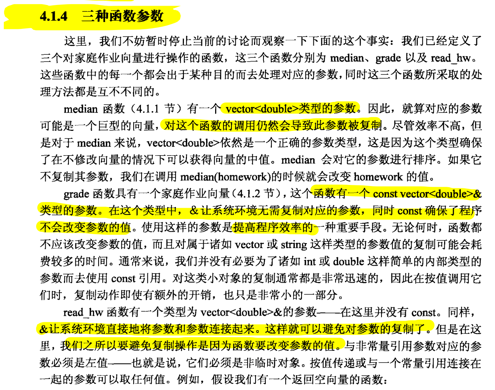

## htonl(),htons(),ntohl(),ntons()--大小端模式转换函数
不同机器内部对变量的字节存储顺序不同，有的采用大端模式(big-endian)，有的采用小端模式(little-endian)。大端模式是指高字节数据存放在低地址处，低字节数据放在高地址处。小端模式是指低字节数据存放在低地址处，高字节数据放在高地址处。在网络上传输数据时，由于数据传输的两端可能对应不同的硬件平台，采用的存储字节顺序也可能不一致，因此 TCP/IP 协议规定了在网络上必须采用网络字节顺序(也就是大端模式) 。通过对大小端的存储原理分析可发现，对于 char 型数据，由于其只占一个字节，所以不存在这个问题，这也是一般情况下把数据缓冲区定义成 char 类型 的原因之一。对于 IP 地址、端口号等非 char 型数据，必须在数据发送到网络上之前将其转换成大端模式，在接收到数据之后再将其转换成符合接收端主机的存储模式。Linux 系统为大小端模式的转换提供了 4 个函数，输入 man byteorder 命令可得函数原型：

```
#include <arpa/inet.h>

uint32_t htonl(uint32_t hostlong);

uint16_t htons(uint16_t hostshort);

uint32_t ntohl(uint32_t netlong);

uint16_t ntohs(uint16_t netshort);

```

htonl 表示 host to network long ，用于将主机 unsigned int 型数据转换成网络字节顺序；

htons 表示 host to network short ，用于将主机 unsigned short 型数据转换成网络字节顺序；

ntohl、ntohs 的功能分别与 htonl、htons 相反。

## C语言结构体的封装
https://blog.csdn.net/weixin_39540315/article/details/111278511

## argc 和 argv
C++的标准库中，关于main函数的形式有：

```c
int main(void);
int main(int argc,char *argv[]) //等同于 int main(int argc,char** argv);
```

这两个参数主要是用来保存程序运行时传递给main函数的命令行参数的。

1.  **argc：是argument count 的缩写，保存运行时传递给main函数的参数个数。**
2.  **argv：是argument vector 的缩写，保存运行时传递main函数的参数，类型是一个字符指针数组，每个元素是一个字符指针，指向一个命令行参数。**

argv[0]指向程序运行时的全路径名；

argv[1] 指向程序在命令行中执行程序名后的第一个字符串；

argv[2] 指向程序在命令行中执行程序名后的第二个字符串；

以此类推直到argv[argc]......

argv[argc] 在C++中指向nullptr，在C语言中指向NULL。

## stdexcept 类

C++中预定义的异常类，分为逻辑异常和运行异常

### logic_error
![[logic_err0.png]]
![[logic_err1.png]]


### runtime_error
![[runtime_err0.png]]

![[runtime_err1.png]]


## 函数的三种参数
1.  foo(int a) 这种参数会从实参将内容拷贝到形参
2.  foo(int& a)这种参数不会拷贝内容，而是直接指向原来的变量
3.  foo(const int& a)这种参数不会拷贝内容，而是直接指向原来的变量，而且const指定为常量，不允许用户修改

第一种参数会拷贝内容，只适用于比较小的变量类型，如int char等，不会消耗太多系统性能；后面两种通常适合于比较大的变量类型，区别在于第二种是可读可写的，第三种是只读的。需要根据函数内部是否要对变量进行修改来决定采用第二种还是第三种。




## 两种迭代器

每一个容器中都定义了两种迭代器：

```cpp
container-type::const_iterator;
container-type::iterator;
```

前者是只读的迭代器，后者是可修改的

## STL 函数：find_if 和 find

### find_if()

```cpp
InputIterator find_if (InputIterator first, InputIterator last, UnaryPredicate pred)
```

first和last

两个迭代器，指示了要寻找的开始和结尾位置

pred

用户定义的寻找符合要求的函数

[find_if - C++ Reference](https://www.cplusplus.com/reference/algorithm/find_if/)

### find()

```cpp
InputIterator find (InputIterator first, InputIterator last, const T& val)
```

first和last

两个迭代器，指示了要寻找的开始和结尾位置

val

用户寻找的特定值

https://www.cplusplus.com/reference/algorithm/find/

## STL 函数：equal 函数

有两种形式，带谓词的和不带谓词的

first1和last1
第一个序列的起点和终点

first2
第二个序列的起点，equal函数默认第二个序列和第一个长度相等

pred
【可选参数】
用户自定义的相等规则

https://www.cplusplus.com/reference/algorithm/equal/

## 五种迭代器
[https://www.cnblogs.com/xiaojianliu/articles/9022239.html](https://www.cnblogs.com/xiaojianliu/articles/9022239.html)

## 迭代器和迭代器范围
[https://www.cnblogs.com/xiaojianliu/articles/8990269.html](https://www.cnblogs.com/xiaojianliu/articles/8990269.html)

## C++11 Lambda 表达式

https://www.cnblogs.com/DswCnblog/p/5629165.html


## auto, auto&, const auto&
先介绍一下auto、const：

在块作用域、命名作用域、循环初始化语句等等  中声明变量时，关键词auto用作类型指定符。

const:修饰符

接下来我们细细分析一下：

（1）auto

auto即 for(auto x:range)  这样会拷贝一份range元素，而不会改变range中元素；

但是！（重点)  使用for(auto x:vector<bool>)时得到一个proxy class,操作时会改变vector<bool>本身元素。应用：for(bool x:vector<bool>)

（2）auto&

当需要修改range中元素，用for(auto& x:range)

当vector<bool>返回临时对象，使用auto&会编译错误，临时对象不能绑在non-const l-value reference （左值引用）需使用auto&&,初始化右值时也可捕获

（3）const auto&

当只想读取range中元素时，使用const auto&,如：for(const auto&x:range),它不会进行拷贝，也不会修改range

（4）const auto

当                                                                                                                                                                                                                                                                     需要拷贝元素，但不可修改拷贝出来的值时，使用 for(const auto x:range)，避免拷贝开销

整理一下：

想要拷贝元素：for(auto x:range)

想要修改元素 :  for(auto &&x:range)

想要只读元素：for(const auto& x:range)

## Memory management
https://chenqx.github.io/2014/09/25/Cpp-Memory-Management/

## VS 文件夹配置
![[vsfold.png]]